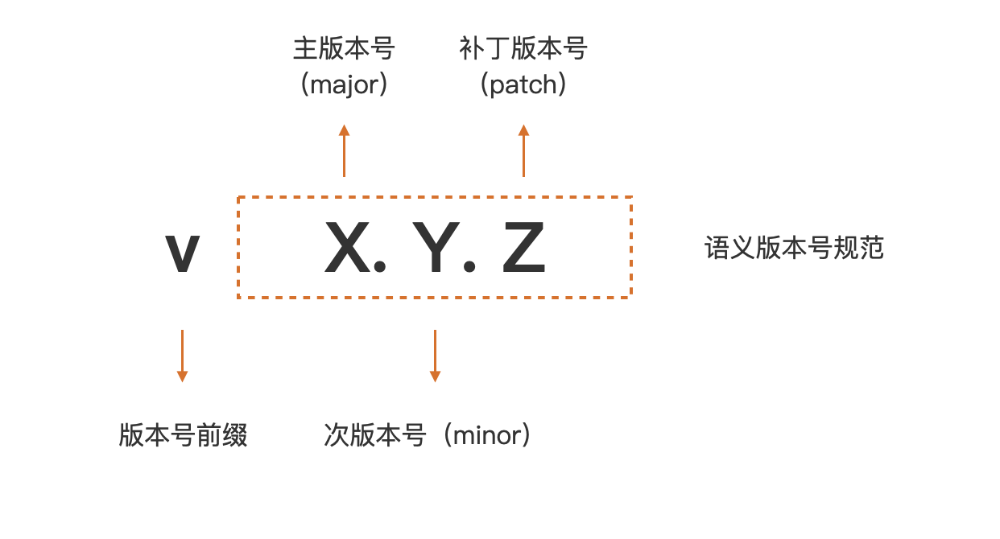

# 02

## Go版本

Go 团队承诺对最新的两个 Go 稳定大版本提供支持

选择最新版本一般没什么问题，保守的也可以选择次新版本

但是现在比较推荐1.17以上的版本，因为这个版本对defer进行了比较大的优化，而且对go module的支持也越来越完善

## Go安装

各安装步骤可以参考官方文档

多版本安装可以通过两种方法

第一种是重新设置 PATH 环境变量

第二种是使用go get 命令，前提是需要已经安装过一个GO版本

    $go get golang.org/dl/go1.15.13

    $go1.15.13 download

    Downloaded   0.0% (    16384 / 121120420 bytes) ...
    Downloaded   1.8% (  2129904 / 121120420 bytes) ...
    Downloaded  84.9% (102792432 / 121120420 bytes) ...
    Downloaded 100.0% (121120420 / 121120420 bytes)
    Unpacking /root/sdk/go1.15.13/go1.15.13.linux-amd64.tar.gz ...
    Success. You may now run 'go1.15.13'

下面贴出一些环境变量设置

    tee -a $HOME/.bashrc <<'EOF'
    # Go envs
    export GOVERSION=go1.17.2 # Go 版本设置
    export GO_INSTALL_DIR=$HOME/go # Go 安装目录
    export GOROOT=$GO_INSTALL_DIR/$GOVERSION # GOROOT 设置
    export GOPATH=$WORKSPACE/golang # GOPATH 设置
    export PATH=$GOROOT/bin:$GOPATH/bin:$PATH # 将 Go 语言自带的和通过 go install 安装的二进制文件加入到 PATH 路径中
    export GO111MODULE="on" # 开启 Go moudles 特性
    export GOPROXY=https://goproxy.cn,direct # 安装 Go 模块时，代理服务器设置
    export GOPRIVATE=
    export GOSUMDB=off # 关闭校验 Go 依赖包的哈希值
    EOF

### 环境变量的含义

| 环境变量    | 含义                                                                                                                                                                                                                                                                                                                                                                                                                             |
| ----------- | -------------------------------------------------------------------------------------------------------------------------------------------------------------------------------------------------------------------------------------------------------------------------------------------------------------------------------------------------------------------------------------------------------------------------------- |
| GOROOT      | Go 语言编译工具、标准库等的安装路径                                                                                                                                                                                                                                                                                                                                                                                              |
| GOPATH      | Go 的工作目录，也就是编译后二进制文件的存放目录和 import 包时的搜索路径                                                                                                                                                                                                                                                                                                                                                          |
| GO111MODULE | 通过设置 on、off、auto 来控制是否开启 Go Modules 特性。 on 代表开启 Go modules 特性，这会让 Go 编译器忽略 $GOPATH和vendor文件夹，只根据go.mod下载依赖； off代表关闭Gomodules特性，这会让 Go编译器在 $GOPATH目录和vendor目录来查找依赖关系，也就是继续使用“GOPATH模式”。而auto在 Go1.14和之后的版本中是默认值； auto代表，源码在 $GOPATH/src 下，并且没有包含 go.mod 则关闭 Go modules，其它情况下都开启 Go modules |
| GOPROXY     | Go 包下载代理服务器。众所周知的原因，在大陆的网络环境下是无法访问 golang.org 等 Google 网站的，但在日 常开发中使用的很多依赖包都要从 Google 的服务器上下载。为了解决无法加载依赖的问题，需要设置一个代理服 务器。以便我们能够使用 go get 下载   direct 作用：当 go 在抓取目标模块时，若遇见了 404 错误，那么就直接去目标模块的源头（比如 GitHub）去抓 取，而不再通过代理服务器                                         |
| GOPRIVATE   | 指定不走代理的 Go 包域名。go get 通过代理服务拉取私有仓库（内部仓库或者托管站点的私有仓库），而代理服 务不可能访问到私有仓库，会出现了 404 错误。go1.13 版本提供了一个方便的解决方案：GOPRIVATE 环境变 量，通过该变量，可以使得指定的包不通过代理下载，而是直接下载                                                                                                                                                              |
| GOSUMDB     | GOSUMDB的值是一个web服务器，默认值是sum.golang.org, 该服务 月                                                                                                                                                                                                                                                                                                                                                                    |

## 程序结构

### 文件名

多个单词直接连接而不是使用分隔符，比如下划线

    helloworld.go  ⭕
    hello_world.go ❌

### 结构
    
    package main // 定义了一个包，main 包在 Go 中是一个特殊的包，整个 Go 程序中仅允许存在一个名为 main 的包

    import "fmt" // fmt代表的是包的导入路径（Import），它表示的是标准库下的 fmt 目录，整个 import 声明语句的含义是导入标准库 fmt 目录下的包

    func main() { // 函数体开始
        fmt.Println("hello, world") // 这里的“fmt”代表的则是包名，首字母大写的函数名表示是导出的对包外可见，如果小写则只能在包内可见
    } // 函数体结束

标准 Go 代码风格使用 Tab 而不是空格来实现缩进的、

main包不能被导入

GO 使用 UTF-8 标准的字符编码方式

语句的结尾不需分号，Go 编译器会自动插入这些被省略的分号

### 编译

    $go build main.go // 编译一个go程序
    $go run main.go // 直接运行 Go 源码文件，多用于开发调试阶段

### Go module 1.16版本默认包管理机制

Go Module 的核心是一个名为 go.mod 的文件

    $go mod init github.com/user/hellomodule // 初始化一个module，添加go.mod文件
    go: creating new go.mod: module github.com/user/hellomodule
    go: to add module requirements and sums:
      go mod tidy

    $cat go.mod
    module github.com/user/hellomodule // 声明 module 的路径

    go 1.16 // Go 版本指示符，表示这个 module 是在某个特定的 Go 版本的 module 语义的基础上编写的

一个 module 就是一个包的集合，这些包和 module 一起打版本、发布和分发。go.mod 所在的目录是 module 的根目录

module 隐含了一个命名空间的概念，module 下每个包的导入路径都是由 module path 和包所在子目录的名字结合在一起构成

    github.com/user/hellomodule // module主路径
    github.com/user/hellomodule/pkg/pkg1 // 子目录 pkg/pkg1 的导入路径

不需要手动添加各个引入的包，用**go mod tidy**命令即可

    $go mod tidy       
    go: downloading go.uber.org/zap v1.18.1
    go: downloading github.com/valyala/fasthttp v1.28.0
    go: downloading github.com/andybalholm/brotli v1.0.2
    ... ...

随后自动生成的go.sum文件，记录了 module 的直接依赖和间接依赖包的相关版本的 hash 值，用来校验本地包的真实性

在构建的时候，如果本地依赖包的 hash 值与 go.sum 文件中记录的不一致，就会被拒绝构建

## Go项目的标准布局

Go 1.4 版本删除了 Go 源码树中“src/pkg/xxx”中 pkg 这一层级目录而直接使用 src/xxx，同时引入了引入 internal 包机制

一个 Go 项目里的 internal 目录下的 Go 包，只可以被本项目内部的包导入

Go1.6 版本增加 vendor 目录，直到 Go 1.7 版本才真正在 vendor 下缓存了其依赖的外部包

Go 1.13 版本引入 go.mod 和 go.sum

### 一个 Go 项目通常分为可执行程序项目和库项目

#### 可执行程序项目的典型结构布局（推荐使用的布局）

    $tree -F exe-layout 
    exe-layout.
    ├── all.bash  <--第三方的构建工具的脚本文件
    ├── make.bash <--第三方的构建工具的脚本文件
    ├── cmd/  <--存放项目要编译构建的可执行文件所对应的 main 包的源码文件
    │   ├── app1/ <--多个可执行文件，每个可执行文件的 main 包可以单独放在一个子目录中
    │   │   └── main.go
    │   └── app2/
    │       └── main.go
    ├── go.mod <--包依赖管理配置文件
    ├── go.sum <--包依赖管理哈希校验文件
    ├── internal/ <--存放仅项目内部引用的 Go 包，这些包无法被项目之外引用
    │   ├── pkga/
    │   │   └── pkg_a.go
    │   └── pkgb/
    │       └── pkg_b.go
    ├── pkg1/ <--项目自身使用、对应main包可执行文件所依赖的库文件，同时这些目录下的包能被外部项目引用
    │   └── pkg1.go
    ├── pkg2/ <--同上
    │   └── pkg2.go
    └── vendor/ <--go build -mod=vendor 可以实现基于 vendor 的构建，这是一个可选目录，为了兼容 Go 1.5 引入 vendor 构建模式而存在

main 包应该保持简洁，在其中会做一些命令行参数解析、资源初始化、日志设施初始化、数据库连接初始化等工作，之后再将程序的执行权限交给更高级的执行控制对象

如果项目结构中存在版本管理的“分歧”，建议将项目拆分为多个项目（仓库），每个项目单独作为一个 module 进行单独的版本管理和演进

单个可执行程序构建项目布局

    $tree -F -L 1 single-exe-layout
    single-exe-layout
    ├── go.mod
    ├── internal/
    ├── main.go
    ├── pkg1/
    ├── pkg2/
    └── vendor/

#### Go 库项目的典型结构布局

    $tree -F lib-layout 
    lib-layout
    ├── go.mod
    ├── internal/
    │   ├── pkga/
    │   │   └── pkg_a.go
    │   └── pkgb/
    │       └── pkg_b.go
    ├── pkg1/
    │   └── pkg1.go
    └── pkg2/
        └── pkg2.go

单个包的库项目布局

    $tree -L 1 -F single-pkg-lib-layout
    single-pkg-lib-layout
    ├── feature1.go
    ├── feature2.go
    ├── go.mod
    └── internal/

## 构建模式

### GOPATH模式

编译器可以在本地 GOPATH 环境变量配置的路径下，搜寻 Go 程序依赖的第三方包

如果存在，就使用这个本地包进行编译，如果不存在，就会报编译错误

如果你没有显式设置 GOPATH 环境变量，就会赋予一个平台对应的默认路径，在 macOS 或 Linux 上，默认值是 $HOME/go

需要先通过go get 下载所依赖的包，不过，go get 下载的包只是那个时刻各个依赖包的最新主线版本，这样会给后续 Go 程序的构建带来一些问题

在 GOPATH 构建模式下，Go 编译器实质上并没有关注 Go 项目所依赖的第三方包的版本

### vendor 机制

Go 在 1.5 版本中引入 vendor 机制。vendor 机制本质上就是在 Go 项目的某个特定目录下，将项目的所有依赖包缓存起来，这个特定目录名就是 vendor

编译器会优先感知和使用 vendor 目录下缓存的第三方包版本，而不是 GOPATH 环境变量所配置的路径下的第三方包版本

如果使用 vendor 机制管理第三方依赖包，最佳实践就是将 vendor 一并提交到代码仓库中，那么其他开发者下载你的项目后，就可以实现可重现的构建

要想开启 vendor 机制，你的 Go 项目必须位于 GOPATH 环境变量配置的某个路径的 src 目录下面

    .
    ├── main.go
    └── vendor/
        ├── github.com/
        │   └── sirupsen/
        │       └── logrus/
        └── golang.org/
            └── x/
                └── sys/
                    └── unix/

### Go Module 机制

* 一个 Go Module 是一个 Go 包的集合
* module 是有版本的，module 下的包也就有了版本属性
* 这个 module 与这些包会组成一个独立的版本单元，一起打版本、发布和分发
* 通常一个代码仓库对应一个 Go Module
* 一个 Go Module 的顶层目录下会放置一个 go.mod 文件，每个 go.mod 文件会定义唯一一个 module
* module 根目录以及它子目录下的所有 Go 包均归属于这个 Go Module

#### 创建一个 Go Module 的步骤

1. 通过 go mod init 创建 go.mod 文件，将当前项目变为一个 Go Module
2. 通过 go mod tidy 命令自动更新当前 module 的依赖信息
3. 执行 go build，执行新 module 的构建。

go mod tidy 会分析当前 main module 的所有源文件，找出了当前 main module 的所有第三方依赖，以及第三方依赖的相关间接依赖包

由 go mod tidy 下载的依赖 module 会被放置在本地的 module 缓存路径下，默认值为 $GOPATH[0]/pkg/mod，Go 1.15 及以后版本可以通过 GOMODCACHE 环境变量，自定义本地 module 的缓存路径

执行完 go mod tidy 后，当前项目会生成一个新文件 go.sum，存放了特定版本 module 内容的哈希值，确保你的项目所依赖的 module 内容，不会被恶意或意外篡改，推荐把 go.mod 和 go.sum 两个文件与源码，一并提交到代码版本控制服务器上

#### 语义导入版本 (Semantic Import Versioning)

    module github.com/user/module-mode

    go 1.16

    require github.com/sirupsen/logrus v1.8.1

go.mod 的 require 段中依赖的版本号，都符合 vX.Y.Z 的格式

一个符合 Go Module 要求的版本号，由前缀 v 和一个满足[语义版本](https://semver.org/)规范的版本号组成

如下图，语义版本号分成 3 部分：主版本号 (major)、次版本号 (minor) 和补丁版本号 (patch)。例如上面的 logrus module 的版本号是 v1.8.1，这就表示它的主版本号为 1，次版本号为 8，补丁版本号为 1

根据兼容与否指定版本号

* 按照语义版本规范，主版本号不同的两个版本相互不兼容
* 在主版本号相同的情况下，次版本号大都是向后兼容次版本号小的版本
* 补丁版本号也不影响兼容性
* 如果同一个包的新旧版本是兼容的，那么它们的包导入路径应该是相同

比如logrus的两个版本 v1.7.0 和 v1.8.1 按照上面的语义版本规则，这两个版本的主版本号相同，新版本 v1.8.1 兼容老版本 v1.7.0 的，那么，无论使用的是 v1.7.0 版本还是 v1.8.1 版本，导入的路径都应该相同：

    import "github.com/sirupsen/logrus" <--v1.7.0 和 v1.8.1都使用这个导入路径

但是加入包更新到了v2.0.0版本，那么 v2.0.0 与 v1.7.0、v1.8.1 就是不兼容的包版本，导入路径需要加上v2改成：
   
    import "github.com/sirupsen/logrus/v2"

Go 的“语义导入版本”机制通过在包导入路径后加上主版本号的方式，来区别同一个包的不兼容版本，这样甚至可以同时依赖一个包的两个不兼容版本：

    import (
        "github.com/sirupsen/logrus"
        logv2 "github.com/sirupsen/logrus/v2"
    )

v0.y.z 这样的版本号用于项目初始不稳定开发阶段的版本号，Go Module 将这样的版本 (v0) 与主版本号 v1 做同等对待，也采用不带主版本号的包导入路径

#### 最小版本选择原则 (Minimal Version Selection)

如果一个项目有两个直接依赖 A 和 B，A 和 B 有一个共同的依赖包 C，但 A 依赖 C 的 v1.1.0 版本，而 B 依赖的是 C 的 v1.3.0 版本，并且此时 C 包的最新发布版为 C v1.7.0

这个时候，Go 会在该项目依赖项的所有版本中，选出符合项目整体要求的“最小版本”，在这个例子中 A 要求 >=C v1.1.0，B 要求 C >=v1.3.0，那么选择同时满足A与B要求的最小版本，同时忽略最新的C v1.7.0，那么最后选择的就是v1.3.0

### Go 各版本构建模式机制和切换

| GO111MODULE | <Go 1.13                                                                                                                                                                                                                                                                          | Go 1.13                                                                                                    | Go 1.16                                                                                            |
| ----------- | --------------------------------------------------------------------------------------------------------------------------------------------------------------------------------------------------------------------------------------------------------------------------------- | ---------------------------------------------------------------------------------------------------------- | -------------------------------------------------------------------------------------------------- |
| on          | 任何路径下都开启Go Module模式                                                                                                                                                                                                                                                     | 任何路径下都开启Go Module模式                                                                              | 默认值：任何路径下都开启Go Module模式                                                              |
| auto        | 默认值：使用GOPATH 模式还是Go Module 模式， 取决于要构建的源码目录所在位置， 以及是否包含go.mod文件。如果要构建的源 码目录不在以GOPATH/src为根的目录体系 下，且包含go.mod文件(两个条件缺一不 可)，那么使用Go Module模式； 否则使用传 统的GOPATH模式 | 默认值：只要当前目录或父目录下有go.mod 文件时，就开Go Module模式， 无论源码目 录是否在GOPATH外面 | 只有当前目录或父目录下有go.mod文件时, 就开启Go Module模式, 无论源码目录是否 在GOPATH外面 |
| off         | GOPATH模式                                                                                                                                                                                                                                                                        | GOPATH模式                                                                                                 | GOPATH模式                                                                                         |

## Go Module的常规操作

### 为当前 module 添加一个依赖

在源码中import了新的包后，需用使用go get github.com/user/pgk 或者 go mod tidy 命令获取包，两者的效果是等价的，但是推荐使用go mod tidy命令

### 升级 / 降级依赖的版本

通过语义导入版本机制在命令或者源码里加上版本号

通过go list查看某个包的所有版本：

    $go list -m -versions github.com/sirupsen/logrus
    github.com/sirupsen/logrus v0.1.0 v0.1.1 v0.2.0 v0.3.0 v0.4.0 v0.4.1 v0.5.0 v0.5.1 v0.6.0 v0.6.1 v0.6.2 v0.6.3 v0.6.4 v0.6.5 v0.6.6 v0.7.0 v0.7.1 v0.7.2 v0.7.3 v0.8.0 v0.8.1 v0.8.2 v0.8.3 v0.8.4 v0.8.5 v0.8.6 v0.8.7 v0.9.0 v0.10.0 v0.11.0 v0.11.1 v0.11.2 v0.11.3 v0.11.4 v0.11.5 v1.0.0 v1.0.1 v1.0.3 v1.0.4 v1.0.5 v1.0.6 v1.1.0 v1.1.1 v1.2.0 v1.3.0 v1.4.0 v1.4.1 v1.4.2 v1.5.0 v1.6.0 v1.7.0 v1.7.1 v1.8.0 v1.8.1

通过go get获取指定的版本号：

    $go get github.com/sirupsen/logrus@v1.7.0
    go: downloading github.com/sirupsen/logrus v1.7.0
    go get: downgraded github.com/sirupsen/logrus v1.8.1 => v1.7.0

通过go mod tidy获取指定的版本号：

    $go mod edit -require=github.com/sirupsen/logrus@v1.7.0
    $go mod tidy       
    go: downloading github.com/sirupsen/logrus v1.7.0

#### 大版本号的升级

既然大版本号不一样了，就说明是互相不兼容的，就应该采用不同的导入路径

    import github.com/user/repo/v2/xxx

    $go get github.com/user/repo/v2

### 移除一个依赖

通过 go list 命令可以列出当前 module 的所有依赖

    $go list -m all
    ... ...
    ... ...

从源代码中移除import的包语句后使用go build命令并不会移除go.mod中的依赖说明语句，需要用 go mod tidy 命令，将这个依赖项彻底从 Go Module 构建上下文中清除掉，go mod tidy 会自动分析源码依赖，而且将不再使用的依赖从 go.mod 和 go.sum 中移除

### 特殊情况：使用 vendor

虽然vendor机制不再受到青睐，然仍是Go Module 构建机制的一个很好的补充

在一些不方便访问外部网络，在一些内部的持续集成或持续交付环境 (CI/CD) 中，使用 vendor 机制可以实现与 Go Module 等价的构建

通过下面命令为该项目建立 vendor：

    $go mod vendor
    $tree -LF 2 vendor
    vendor <--项目的依赖包的副本
    ├── github.com/
    │   ├── google/
    │   ├── magefile/
    │   └── sirupsen/
    ├── golang.org/
    │   └── x/
    └── modules.txt <--记录了 vendor 下的 module 以及版本

基于 vendor 构建的命令：

    $go build -mod=vendor

## Go程序的执行次序

### main.main 函数：Go 应用的入口函数

    package main
    
    func main() {
        // 用户层执行逻辑
        ... ...
    }

可执行程序的 main 包必须定义 main 函数

有多个 Goroutine 运行的时候，main.main 函数将在主 Goroutine 中执行

main.main 函数返回意味着整个 Go 程序结束，即使有其他的子 Goroutine 正在执行

在其他包里也可以定义main函数，但是不建议这么做

### init 函数：Go 包的初始化函数

    func init() {
        // 包初始化逻辑
        ... ...
    }

init 函数的执行就都会发生在 main 函数之前，不管是 main 包自身或者依赖的包中定义了 init 函数，Go 程序在这个包初始化的时候会自动调用其 init 函数

不能手工显式地调用 init 函数

每个组成 Go 包的 Go 源文件中，也可以定义多个 init 函数，同个源文件的多个 init 函数按顺序执行

### init 函数常见的用途

* 重置包级变量值
* 实现对包级变量的复杂初始化
* 在 init 函数中实现“注册模式”（工厂设计模式）- 空导入

### Go 包的初始化次序

Go 会根据包导入的顺序，先去初始化 main 包的第一个依赖包

依赖包按“深度优先”的次序进行，递归初始化各个包的依赖包，也就是最后被依赖的那个包先初始化

在查找到层次最深的那个包的时候，按以“常量 -> 变量 -> init 函数”的顺序进行初始化

包内的多个 init 函数按出现次序进行自动调用

然后返回上一个包对齐进行同样的初始化操作

最后初始化main包自身